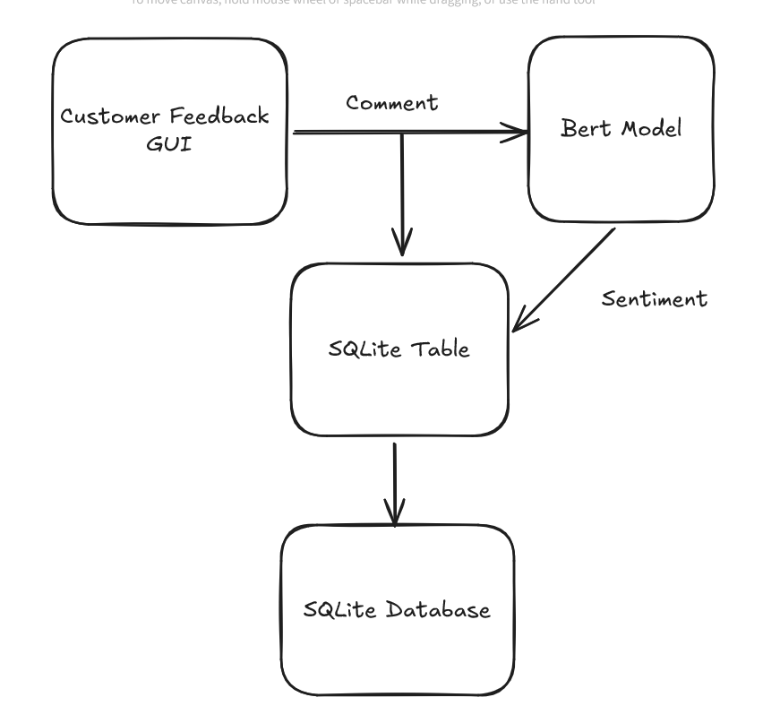
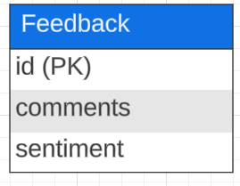
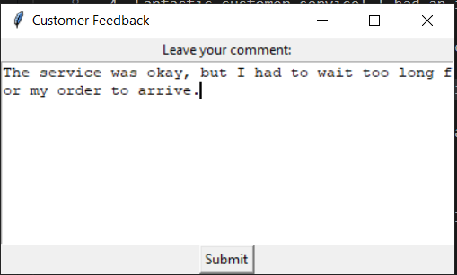
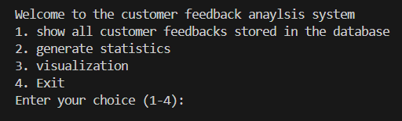
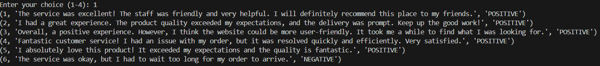
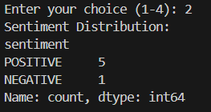
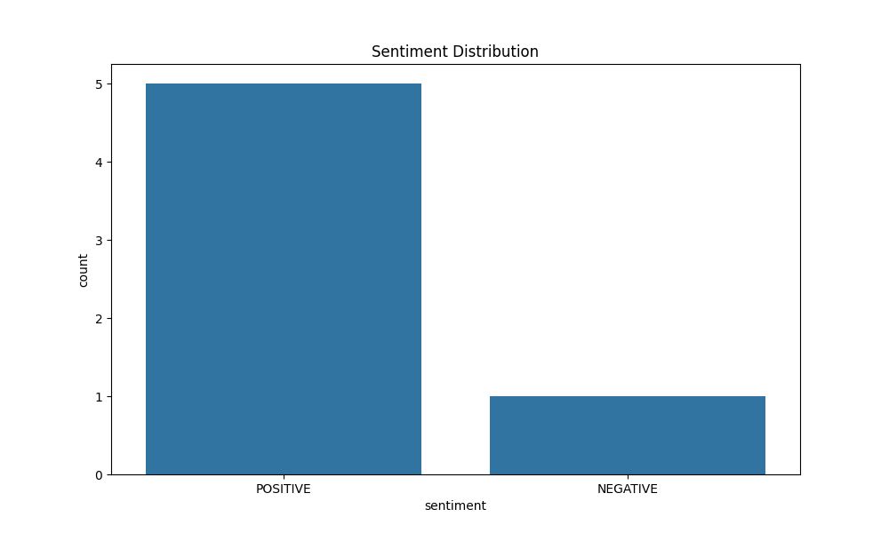

# Customer Feedback Analysis System
This project aims to create a Customer Feedback Analysis System. This Python-based system allows you to collect, analyze, and visualize customer feedback. Whether you’re a business owner, a product manager, or just curious about what your customers think, this system has you covered.

# Customer Feedback Flowchart

# Database Schema

# Features
1. Tkinter GUI for Customer Comments:
   * Users can submit their comments through a user-friendly graphical interface.
   * The system captures these comments and performs sentiment analysis.

1. Sentiment Analysis with BERT:
   * We use a pre-trained BERT model to analyze the sentiment of each comment.
   * Sentiment labels (positive/negative) are stored in the database.
  
2. SQLite Database Storage:
Customer comments and their sentiment labels are stored in an SQLite database (`customer_feedback.db`).

1. Terminal Interface for Staff:
   * Staff members can query the database via a terminal interface.
   * Retrieve feedback records, generate statistics, and more.

2. Visualization of Customer Feedback:
   * A bar plot visualizes the distribution of positive and negative feedback.

# Getting Started
1. Installation:
Make sure you have Python installed (version 3.6 or higher).

Install required packages using `pip install -r requirements.txt`.

2. Running the System:
Execute `main.py` to start the system.
Follow the menu options to explore feedback data.

3. Customization:
Feel free to fine-tune the sentiment analysis model or adjust the GUI layout.
Modify the database schema or add more features as needed.

# Customer Feedback GUI

* With one-clink of submit button, the customer feedback will be stored into the SQLite database

# Terminal Interface

# Example Outputs
Option 1: Print Feedback

Option2: Generate Statistics

Option3: Visualization

# Dependencies
* sqlite3
* pandas
* matplotlib
* seaborn
* transformers

# Acknowledgments
The sentiment analysis model is based on the DistilBERT model.
Thanks to the open-source community for their contributions.

# License
This project is licensed under the MIT License. Feel free to use, modify, and share.